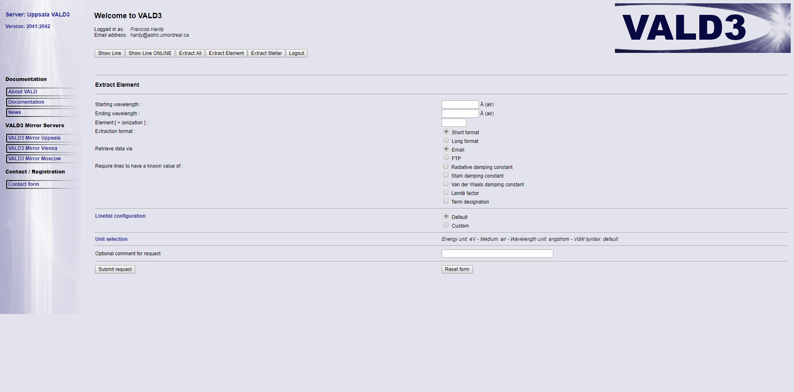

# Instructions pour les données de VALD #

1. Se faire un compte sur http://vald.astro.uu.se/~vald/php/vald.php

    Contact / Registration, Contact Form, envoyer un message à l'administrateur
    
2. Une fois enregistré, se connecter au mirroir VALD3 Mirror Uppsala (J'ai rencontré des difficultés avec les autres mirrors)

 

3. Pour obtenir les tables pour un élément en particulier, aller dans Extract Element

4. Entrer le domaine de longueurs d'onde nécessaire (Starting, Ending wavelength)

    J'utilise 1 à 100000 par exemple
    
5. Entrer l'élément [et l'état d'ionisation, optionnel] de la forme: Al [2]

6. Choisir Extraction format: Long format

    Ce n'est pas nécessaire pour notre code ici, mais mes scripts assument le Long format
    
7. Choisir Retrieve data via: FTP

8. Laisser le reste par défaut

9. Vous allez recevoir un courriel avec deux liens pour télécharger une archive avec le fichier, ainsi que les références. Pour que mes scripts fonctionnent, je renomme les fichiers comme X.vald (X étant le symbole de l'élément) et j'efface manuellement les dernières lignes du fichiers, avec les références.

10. Mettre le fichier X.vald dans le répertoire VALD/RAW/ du code, et exécuter 'python mk_vald.py' en étant dans le répertoire VALD/ .

Vous avez maintenant les fichiers formatés pour les éléments dans VALD/RAW/ !

Les fichiers d'inputs sont dans le répertoire input/, avec la même nomenclature que pour les fichiers de TOPBASE
